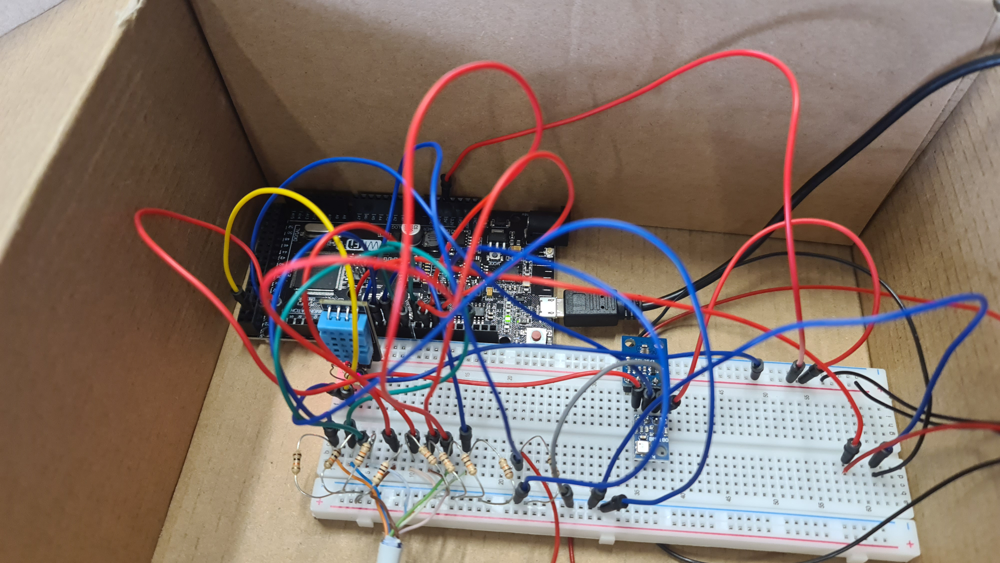
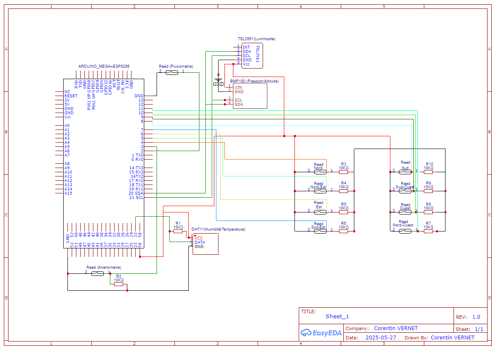

#### weather_station_project

# 🌦️ **Station Météo**

Ce projet est une station météo connectée qui récupère des données en temps réel (comme la température, la pression atmosphérique, l'humidité, la hauteur de pluie, l'altitude, direction du vent, vitesse du vent et la luminosité) via des capteurs connectés à un microcontrôleur (Arduino) et les affiche sur un site web.

Le projet comprend un back-end en Python (Flask) qui sert les données via une API, un front-end en HTML, CSS, et JavaScript pour afficher les informations et un Arduino qui capte les données environnementales.

## 🔧 Technologies utilisées

- 🎛️ **Arduino Mega** – Capteurs environnementaux
- 🎛️ **Esp8266** – Envoi des données à l'API
- 🐍 **Python (Flask)** – Back-end & API FLASK
- 🖥️ **HTML/CSS/JS** – Interface utilisateur (Front-end)
- 🍓 **Raspberry Pi** – Hébergement local

## 🚀 Fonctionnalités :

#### 🔴 Vue en temps réel :

La page principale affiche des informations en temps réel sur la température, l'humidité, la pression atmosphérique, la hauteur de pluie, la luminosité, l'altitude, la direction du vent et la vitesse du vent.

#### 🌦️ État météo global :

Un état général de la météo (comme _ensoleillé_, _pluvieux_, _nuageux_) est calculé automatiquement à partir des données collectées et affiché en temps réel.

#### 📅 Historique des données :

Une page d'historique permet de consulter les données passées en fonction d'une date spécifique grâce à la base de données.

#### 🔁 Actualisation des données :

Les utilisateurs peuvent actualiser manuellement les données ou tout actualiser en un clic.

## 📁 Arborescence du projet

```text
weather_station_project
├── history.html
├── index.html
├── README.md
├── weather.db
├── styles/
│ ├── base.css
│ ├── calendar.css
│ ├── components.css
│ ├── globalWeather.css
│ ├── history_styles.css
│ ├── layout.css
│ └── typography.css
├── js/
│ ├── history.js
│ ├── main.js
│ └── headerContent/
│   ├── calendar.js
│   ├── dateTime.js
│   └── globalWeatherState.js
├── img/
│ ├── database.png
│ ├── logo_stjacques.png
│ ├── static_background.png
│ ├── video_background.mp4
│ └── components_logo/
│ ├── altitude_logo.png
│ ├── atmospheric_pressure.png
│ ├── brightness.png
│ ├── rain_height.svg
│ ├── thermometer.svg
│ ├── water_drop.png
│ ├── wind_direction.png
│ └── wind_speed.svg
├── fonts/
│ └── Orbitron-VariableFont_wght.ttf
├── data_working/
│ └──weather_api.py
├── arduino/
│ ├── wind_direction-wind_speed/
│ │ └── wind_direction-wind_speed.ino
│ ├── test final pour l'envoi des données/
│ │ ├── test_pour_mega/
│ │ │ └── test_pour_mega.ino
│ │ └── test_pour_esp/
│ │ └── test_pour_esp.ino
│ ├── press**alt**temp**hum/
│ │ └── press**alt**temp**hum.ino
│ └── code_pluviometre/
│ └── code_pluviometre.ino
```

## ▶️ Lancer le projet :

- Brancher l'Arduino Mega sur une alimentation.
- Brancher le Raspberry Pi sur une alimentation.

> ⚙️ **Note :** L'API et le serveur python se lancent automatiquement au démarrage du Raspberry.

### 📶 Connexion au Wi-Fi du Raspberry Pi

Pour vous connecter au Raspberry Pi :

- **SSID** : `MeteoPi`
- **Mot de passe** : `stjacquesmeteo`

---

- Sur le Raspberry Pi, lancer le fichier `weather_api.py` (API) :

  - $ cd weather_station_project/data_working/
  - $ source venv/bin/activate
  - $ python3 weather_api.py

- Il faut aussi lancer un serveur pour le site :

  - $ python -m http.server 8000

---

- Pour aller sur le site, il suffit d'entrer l'adresse ip du Raspberry Pi suivie du port `8000`. Ex :

```js
http://[adresse_ip_du_raspberry]:8000
```

### 📌 Pour envoyer des codes arduino dans l'Arduino Mega ou l'ESP :

> #### PC --> Mega :

    | 1   | 2   | 3   | 4   | 5   | 6   | 7   | 8   |
    | --- | --- | --- | --- | --- | --- | --- | --- |
    | off | off | on  | on  | on  | on  | off | off |

> #### PC --> ESP8266 :

    | 1   | 2   | 3   | 4   | 5   | 6   | 7   | 8   |
    | --- | --- | --- | --- | --- | --- | --- | --- |
    | off | off | off | off | on  | on  | on  | off |

> #### Mega <--> ESP8266 (Etat normal quand programme lancé):

    | 1   | 2   | 3   | 4   | 5   | 6   | 7   | 8   |
    | --- | --- | --- | --- | --- | --- | --- | --- |
    | on  | on  | off | off | off | off | off | off |

### 🌬️ Couleur des fils pour la direction du vent :

| 🧭 Direction | 🎨 Couleur du fil |
| ------------ | ----------------- |
| Nord         | Orange            |
| Sud          | Blanc-Bleu        |
| Est          | Blanc-Orange      |
| Ouest        | Vert              |
| Nord-Est     | Blanc-Vert        |
| Nord-Ouest   | Blanc-Marron      |
| Sud-Est      | Bleu              |
| Sud-Ouest    | Marron            |

---

> ⚙️ **Ce qu’il me reste à faire :**

1. 🔄 **Transfert sur carte électronique :**  
   Remplacer le montage actuel sur **Lab500** par une **carte électronique dédiée**, en y transférant :

   - Les **capteurs électroniques** :

     - `DHT11` (température / humidité)
     - `BMP180` (pression / altitude)
     - `TSL2561` (luminosité)

   - Les **capteurs mécaniques** :
     - `Girouette` (direction du vent)
     - `Anémomètre` (vitesse du vent)
     - `Pluviomètre` (hauteur des précipitations)

2. 🧱 **Assemblage sur le pied :**  
   Monter l’ensemble (carte Arduino Mega + capteurs) sur le **pied prévu**, avec toutes les **bases** accueillant les différents modules.

3. ✅ **Tests finaux :**  
   Vérifier le **fonctionnement complet** du système, ainsi que la **bonne orientation** des capteurs (notamment la girouette).

---

### Câblage :



---

### Interface Web :


---

### Schéma Eletronique :



---

## 📝 Auteurs / Contributions

- 👨‍💻 **Corentin Vernet** – Développement principal, conception et intégration (corentin.informatique89@gmail.com)
- 👥 **Classe de 1ère Pro CIEL** – Contributions ponctuelles
- 👨‍🏫 **Mr Longet** / **Mr Dumant** – Accompagnement technique et pédagogique, encadrement et conseils sur le projet
